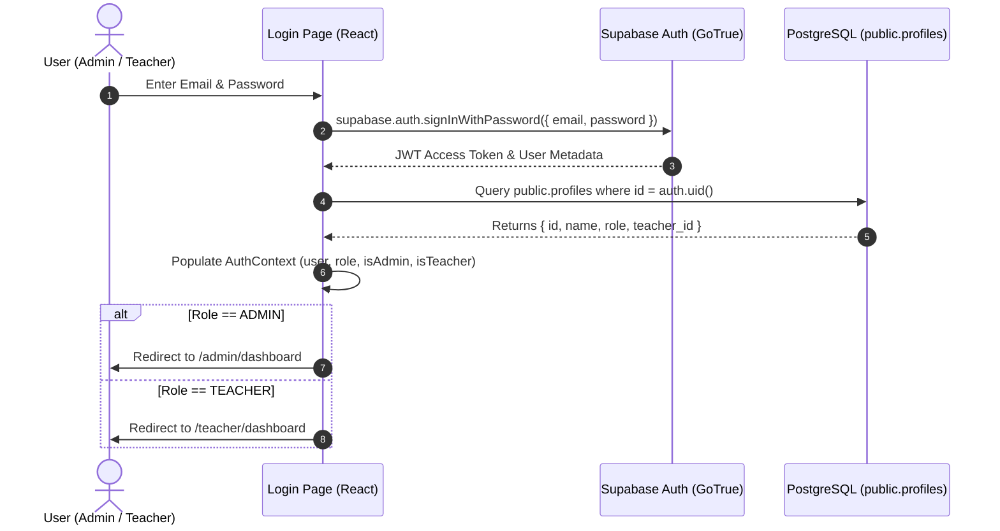
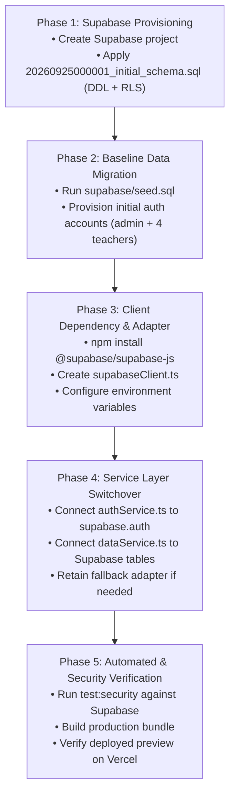

# Akshar Connect — Backend Migration Plan & Architecture Specification
**Target Platform:** Supabase Auth + PostgreSQL 15+ + Row-Level Security (RLS)  
**Organization:** Akshar Paaul Educational NGO  
**Scope:** Migration from client-side `localStorage`/in-memory service to persistent, production-grade cloud backend.

---

## 1. Executive Summary & Architectural Vision

Akshar Connect currently manages attendance operations, student rosters, and teacher records via a mock service layer (`src/services/dataService.ts`, `src/services/authService.ts`) backed by browser `localStorage`. 

The future architecture transitions the application to **Supabase (PostgreSQL + Supabase Auth + Row-Level Security)**. The core philosophy of this migration is:
1. **Zero UI Disruption**: The React front-end components, forms, and pages continue using identical TypeScript interfaces and service contracts.
2. **Security at the Database Engine**: Authorization is enforced not just in client code, but cryptographically through PostgreSQL Row-Level Security (RLS) and JWT claims.
3. **Institutional Simplicity**: Retain simple school naming (`3-A`, `4-B`, `5-A`, `7-A`) and clean data normalization with zero invented campus/center abstractions.

---

## 2. Current vs. Future Architecture Mapping

### 2.1 Entity Mapping Table

| LocalStorage Entity / Interface | Future Supabase Table | Key Differences & Transformations |
| :--- | :--- | :--- |
| `User` (`Role = 'ADMIN' \| 'TEACHER'`) | `auth.users` + `public.profiles` | Authenticated via Supabase GoTrue. `profiles.id` is a 1:1 foreign key referencing `auth.users.id`. Roles stored in `profiles.role` (`user_role` enum). |
| `Teacher` | `public.teachers` | Normalized entity. Uncouples array `assignedClassIds: string[]` into a relational junction table `teacher_classes`. |
| `ClassEntity` | `public.classes` | Strips deprecated `learningCenter` field. Removes denormalized `assignedTeacherName` and `studentCount` (computed dynamically via SQL aggregation/JOINs or generated views). |
| *Embedded class array* | `public.teacher_classes` | **New Relational Junction Table**: Establishes many-to-many relationship between `teachers` and `classes` with explicit constraints (`UNIQUE(teacher_id, class_id)`). |
| `Student` | `public.students` | `classId` maps to foreign key `class_id REFERENCES classes(id)`. Unique constraint on `(class_id, roll_number)`. |
| `AttendanceRecord` | `public.attendance_records` | `date` formatted as native `DATE`. Unique constraint on `(student_id, date)` preventing duplicate attendance records on the same day. |

---

### 2.2 Field-by-Field Mapping & Data Types

#### `profiles` Table
```sql
id          UUID PRIMARY KEY REFERENCES auth.users(id) ON DELETE CASCADE
email       TEXT NOT NULL UNIQUE
name        TEXT NOT NULL
role        user_role NOT NULL DEFAULT 'TEACHER' -- ('ADMIN', 'TEACHER')
teacher_id  TEXT NULL REFERENCES teachers(id)    -- Set if role is TEACHER
phone       TEXT NULL
avatar_url  TEXT NULL
created_at  TIMESTAMPTZ NOT NULL DEFAULT NOW()
updated_at  TIMESTAMPTZ NOT NULL DEFAULT NOW()
```

#### `teachers` Table
```sql
id            TEXT PRIMARY KEY                   -- e.g., 'tch-1'
name          TEXT NOT NULL
email         TEXT NOT NULL UNIQUE
phone         TEXT NOT NULL
status        user_status NOT NULL DEFAULT 'active' -- ('active', 'inactive')
qualification TEXT NULL
joined_date   DATE NOT NULL DEFAULT CURRENT_DATE
created_at    TIMESTAMPTZ NOT NULL DEFAULT NOW()
updated_at    TIMESTAMPTZ NOT NULL DEFAULT NOW()
```

#### `classes` Table
```sql
id          TEXT PRIMARY KEY                     -- e.g., 'cls-1'
name        TEXT NOT NULL UNIQUE                 -- e.g., '3-A', '4-B'
grade       TEXT NOT NULL                        -- e.g., 'Class 3'
schedule    TEXT NOT NULL                        -- e.g., 'Mon - Fri (09:00 AM - 01:00 PM)'
created_at  TIMESTAMPTZ NOT NULL DEFAULT NOW()
updated_at  TIMESTAMPTZ NOT NULL DEFAULT NOW()
```

#### `teacher_classes` Junction Table
```sql
id          UUID PRIMARY KEY DEFAULT gen_random_uuid()
teacher_id  TEXT NOT NULL REFERENCES teachers(id) ON DELETE CASCADE
class_id    TEXT NOT NULL REFERENCES classes(id) ON DELETE CASCADE
assigned_at TIMESTAMPTZ NOT NULL DEFAULT NOW()
UNIQUE (teacher_id, class_id)
```

#### `students` Table
```sql
id              TEXT PRIMARY KEY                 -- e.g., 'std-1'
roll_number     TEXT NOT NULL                    -- e.g., '3A-01'
name            TEXT NOT NULL
class_id        TEXT NOT NULL REFERENCES classes(id) ON DELETE RESTRICT
gender          student_gender NOT NULL DEFAULT 'male' -- ('male', 'female', 'other')
status          user_status NOT NULL DEFAULT 'active'
guardian_name   TEXT NULL
guardian_phone  TEXT NULL
dob             DATE NULL
created_at      TIMESTAMPTZ NOT NULL DEFAULT NOW()
updated_at      TIMESTAMPTZ NOT NULL DEFAULT NOW()
UNIQUE (class_id, roll_number)
```

#### `attendance_records` Table
```sql
id          TEXT PRIMARY KEY                     -- e.g., 'att-xxx'
student_id  TEXT NOT NULL REFERENCES students(id) ON DELETE CASCADE
class_id    TEXT NOT NULL REFERENCES classes(id) ON DELETE CASCADE
date        DATE NOT NULL                        -- YYYY-MM-DD
status      attendance_status NOT NULL           -- ('present', 'absent')
marked_by   TEXT NOT NULL                        -- Name or ID of recording user
notes       TEXT NULL
created_at  TIMESTAMPTZ NOT NULL DEFAULT NOW()
updated_at  TIMESTAMPTZ NOT NULL DEFAULT NOW()
UNIQUE (student_id, date)                        -- Enforces single daily record per student
```

---

## 3. Row-Level Security (RLS) & Access Control Matrix

All tables will have Row-Level Security enabled (`ALTER TABLE ... ENABLE ROW LEVEL SECURITY`). Access policies rely on PostgreSQL security definer helper functions:

```sql
-- Helper function: Is the caller an Administrator?
CREATE OR REPLACE FUNCTION public.is_admin()
RETURNS BOOLEAN LANGUAGE sql SECURITY DEFINER STABLE AS $$
    SELECT EXISTS (SELECT 1 FROM public.profiles WHERE id = auth.uid() AND role = 'ADMIN');
$$;

-- Helper function: Get teacher_id of the caller
CREATE OR REPLACE FUNCTION public.get_current_teacher_id()
RETURNS TEXT LANGUAGE sql SECURITY DEFINER STABLE AS $$
    SELECT teacher_id FROM public.profiles WHERE id = auth.uid() AND role = 'TEACHER';
$$;

-- Helper function: Is the caller assigned to class_id?
CREATE OR REPLACE FUNCTION public.is_teacher_assigned_to_class(check_class_id TEXT)
RETURNS BOOLEAN LANGUAGE sql SECURITY DEFINER STABLE AS $$
    SELECT EXISTS (
        SELECT 1 FROM public.teacher_classes tc
        JOIN public.profiles p ON p.teacher_id = tc.teacher_id
        WHERE p.id = auth.uid() AND p.role = 'TEACHER' AND tc.class_id = check_class_id
    );
$$;
```

### 3.1 Permission Matrix

| Table | Operation | Administrator Access | Teacher Access Rule |
| :--- | :--- | :--- | :--- |
| **`profiles`** | SELECT | Read all profiles | Read own profile only (`id = auth.uid()`) |
| | UPDATE | Full update access | Update own contact/profile details only |
| | INSERT / DELETE | Admin only | Denied |
| **`teachers`** | SELECT | Read all teachers | Read own teacher record (`id = get_current_teacher_id()`) |
| | INSERT / UPDATE / DELETE | Full CRUD | Denied |
| **`classes`** | SELECT | Read all classes | Read assigned classes only (`is_teacher_assigned_to_class(id)`) |
| | INSERT / UPDATE / DELETE | Full CRUD | Denied |
| **`teacher_classes`** | SELECT | Read all assignments | Read own assignments (`teacher_id = get_current_teacher_id()`) |
| | INSERT / UPDATE / DELETE | Full CRUD | Denied |
| **`students`** | SELECT | Read all students | Read students in assigned classes only |
| | INSERT / UPDATE / DELETE | Full CRUD | Denied |
| **`attendance_records`** | SELECT | Read all records | Read records for assigned classes only |
| | INSERT | Insert for any class | Insert records only for assigned classes |
| | UPDATE | Update any record | Update records only for assigned classes |
| | DELETE | Admin only | Denied |

---

## 4. Authentication Flow



### Automatic Profile Synchronization Trigger
When an administrative user or teacher is created in `auth.users`, a database trigger automatically synchronizes their entry into `public.profiles`:

```sql
CREATE OR REPLACE FUNCTION public.handle_new_user()
RETURNS TRIGGER LANGUAGE plpgsql SECURITY DEFINER SET search_path = public AS $$
BEGIN
    INSERT INTO public.profiles (id, email, name, role, teacher_id)
    VALUES (
        NEW.id,
        NEW.email,
        COALESCE(NEW.raw_user_meta_data->>'name', split_part(NEW.email, '@', 1)),
        COALESCE((NEW.raw_user_meta_data->>'role')::user_role, 'TEACHER'),
        NEW.raw_user_meta_data->>'teacher_id'
    );
    RETURN NEW;
END;
$$;

CREATE TRIGGER on_auth_user_created
    AFTER INSERT ON auth.users
    FOR EACH ROW EXECUTE FUNCTION public.handle_new_user();
```

---

## 5. Client Service Layer Adaptation Strategy

To maintain complete UI stability, the frontend will adopt an **Adapter Pattern** when switching from `localStorage` to Supabase.

### 5.1 Step 1: Create Supabase Client Singleton
File: `src/services/supabaseClient.ts`
```typescript
import { createClient } from '@supabase/supabase-js';

const supabaseUrl = import.meta.env.VITE_SUPABASE_URL;
const supabaseAnonKey = import.meta.env.VITE_SUPABASE_ANON_KEY;

if (!supabaseUrl || !supabaseAnonKey) {
  console.warn('Supabase credentials missing. Ensure .env has VITE_SUPABASE_URL and VITE_SUPABASE_ANON_KEY.');
}

export const supabase = createClient(supabaseUrl || '', supabaseAnonKey || '');
```

### 5.2 Step 2: Swap `dataService.ts` Internals (Preserving Public Interface)
The public methods on `dataService` remain identical:
- `getClasses()`
- `getStudents({ classId, search })`
- `getTeachers()`
- `getAttendance({ classId, date, studentId })`
- `saveAttendance(classId, date, items, markedByName)`
- `getAdminDashboardData()`
- `getTeacherDashboardData(teacherId)`

Instead of `loadData()` from `localStorage`, each method will execute a `supabase.from('...')` query. Because RLS is active, queries automatically return only authorized rows for the session token.

---

## 6. Environment Configuration & CI/CD Setup

### 6.1 Required `.env.example`
Created at repository root (`.env.example`):
```bash
# Supabase Project API URL
VITE_SUPABASE_URL=https://your-project-ref.supabase.co

# Supabase Anon / Public Key (Protected by RLS)
VITE_SUPABASE_ANON_KEY=eyJhbGciOiJIUzI1NiIsInR5cCI6IkpXVCJ9...
```

### 6.2 Vercel Deployment Settings
In the Vercel dashboard:
1. Navigate to: **Project Settings → Environment Variables**.
2. Add:
   - `VITE_SUPABASE_URL`
   - `VITE_SUPABASE_ANON_KEY`
3. Scope to **Production**, **Preview**, and **Development**.
4. Redeploy project — Vite will inject the variables into the client build.

---

## 7. Migration Execution Order

When scheduled for implementation, the cutover will execute in this strict order:



---

## 8. Checklist Before Backend Implementation Cutover

- [x] Database Schema DDL created (`supabase/migrations/20260925000001_initial_schema.sql`)
- [x] Baseline seed script created (`supabase/seed.sql`)
- [x] RLS policies defined for all tables and roles
- [x] Environment template created (`.env.example`)
- [x] Frontend contracts and interfaces preserved without UI disruption
- [ ] Supabase Project created by administrator
- [ ] Vercel environment variables configured
